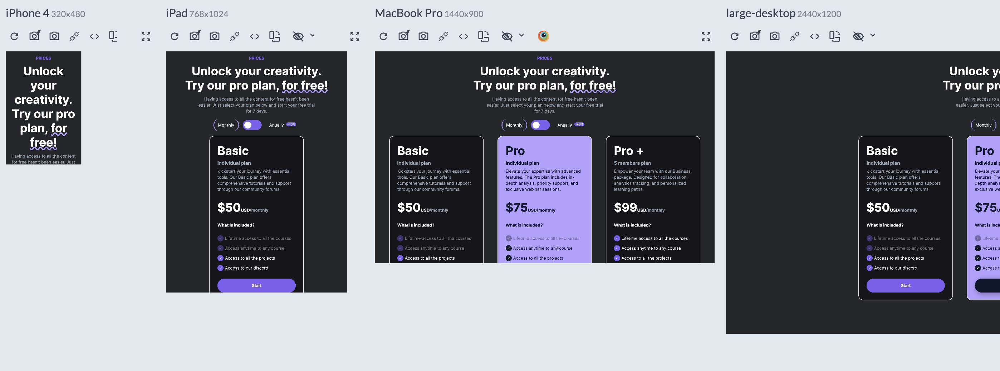

# Block 4 - Figma Design & Figma to Code

## 🤯 Project 2 – Pro Creativity

**_Classes_**, **_Semantic_** & **_BEM_** naming system to the test 💪!

### 🏁 STEPS:

1. Your task is to create a website that **_closely_** resembles (looks as close as possible) to the one found under `/design` folder:<br>
   ⚠️ **_NOTE_**: Make sure your final design also follows what is inside `/design/responsive`, `design/responsive/videos` `design/hover-states/static`, `/design/hover-states/videos` videos and screenshots. <br>

---


---

### Responsive Design with Flexbox 💪

💡 Make sure your design adapts to the following screens



---

### Hover States 👆


https://github.com/juan-instructor-atc/block-4-project-2-pro-creativity/assets/129880571/ae151e82-3e31-4a88-b6e1-3e8963c413c0

---

### ⚠ The ONLY padding allowed (no borders transparent allowed to create spacing):


### ⚠ The ONLY margin allowed (no borders transparent allowed to create spacing):


---

2. ⚠ Getting more organized.

- The `CSS` no longer will be a child of the `<head>` element.
- Using **_External Stylesheets_** is a way of getting your projects more organized.
  - Read more on how to structure the `CSS` using external sheets:
    - [How CSS is structured](https://developer.mozilla.org/en-US/docs/Learn/CSS/First_steps/How_CSS_is_structured)
    - [How to link external stylesheets](https://www.quackit.com/css/external_style_sheets.cfm)
- Make sure your new `styles.css` file is located in the `root folder` at path `/css/styles.css`.
- Also, create any necessary files for your project. Ex. `index.html` and any other files/folders required in this project `root folder`. <br>

---

3. By following semantic HTML best practices, in this project you can **_ONLY_** and **_MUST_**:

```HTML
<link> <!-- link to your stylesheet -->
<main></main> <!-- Only ONE per page -->
<section></section> <!-- Must be used only ONE time -->
<header></header>
<h1></h1> <!-- Only ONE per page -->
<hgroup></hgroup>
<h2></h2>
<br /> <!-- This element must be used only ONE time -->
<span></span>
<p></p>
<div></div>

<article></article> <!-- This element must be used THREE times -->
<h3></h3>
<ul></ul>
<li></li>
<button></button>

```

4. You are expected to do your own research on elements we have not used before. Part of your grade relies on choosing the right elements and analyzing the page to create meaning from the content. As shown in class, please use the following resoures to do the research. Element must be **_SEMANTIC_** (There is multiple ways to markup the page, choose wisely):

- ⚠️ Do not create a `<div>` soup.
- [HTML Spec](https://html.spec.whatwg.org/multipage/#toc-semantics)
- [MDN Semantic](https://developer.mozilla.org/en-US/docs/Glossary/semantics)

5. Do not forget to **_validate_** your HTML document before submitting (make sure there is no errors): [HTML validator](https://validator.w3.org/#validate_by_input)

- Make sure you select **_outline_** and the **_outline_** of your document also makes sense:

<br>
<br>

6. We are going to use **_Google Fonts_**. Use the `@import` statement.

- [Google Fonts Search](https://fonts.google.com/)
  - Search for the font `Inter`
  - Weights: `300`, `400` and `700`

7. Use **_ColorPicker Eyedropper_** to find HEX colors.

---

### Responsively Setup 💪


---

11. Install the **_Ruler Extension_**. Use **_Firefox Developer Edition_** and install the extension using this link [link-to-ruler](https://addons.mozilla.org/en-US/firefox/addon/measure-it/)

12. Once you install it. You will see the following icon:
    

13. Click on that icon and drag your mouse anywhere to measure spaces.
    

---

14. The **_ONLY_** CSS **_ALLOWED_** and you can **_RESEARCH_** more about is the following:<br>
    ⚠️ **_NOTE_**: You cannot use **_negative margin_**<br>

    - You must use `class` `wrapper` to contain all graphical elements in a single container.

      - You must ONLY use `max-width` of `1440px` **_ONLY_** 1 time with `class` of `wrapper`.

    - `max-width` of `500px` must ONLY be used one time in the following element/container:
      
    - The only value allowed for `margin` is ` 0 auto` and must be used ONLY **_1_** time.

    - `text-align` can only be used in the following container:
      

    - Checkmark icon (**_not container_**) must have a `width` of `10px` and `height` `10px`
      

    - The following element is allowed to have `width` and `height` using **_REM_** units
      

    - The following elements are allowed to have `width` and `height` using **_REM_** units
      

    - `font-family: "Inter", sans-serif` can only be used **_1_** time.

    - `padding`, `font-size`, `gap`, `column-gap`, `row-gap`, `line-height`, `flex-basis`, `width`, `height` must use **_REM_** units.

      - To convert `px` to `rem`: [rem-converter](https://nekocalc.com/px-to-rem-converter)

    - You can use `line-height` only **_2_** times.

    - `width` and `height` are not allowed.
    - You **_cannot_** use `ids`.
    - Only the `class` attribute is allowed using the [BEM naming system](https://getbem.com/naming/)
      - `class` styles must be reused. Duplicating styles is not **_ALLOWED_**.
      - `class names` MUST follow the **_BEM_** system for every HTML element. Names must be **_MEANINGFUL_** and based on **_content_**.
      - Validate your `BEM Classes` using the following two tools before submission: [Tool One](https://nglazov.github.io/bem-validator-page/) and [Tool Two](https://bem-class-names-checker.netlify.app/). Make sure there are no errors.
    - In your `style.css` file, you are only allowed to have `.classes`. No other selectors are allowed. Ex. (main div, article li, .class li, .container:nth-of-type(2), etc)
    - Do not forget to use `flex` in the `devtools`.
    - ⚠️ Start every project with this css, you will remove every default padding or margin and adjust the base width of boxes.

```CSS
   * {
      margin: 0;
      padding: 0;
      box-sizing: border-box;
   }
```

```CSS
selector {
  opacity: /* You should make your own research */;
  font-family: /* Any font you have linked from Google Fonts */;
  font-size: /;
  font-weight:;
  line-height:;
  :hover;
  text-transform:;
  text-decoration: /* Pay attention to different styles */;
  color: /* HEX color */;
  display: /* Values can only be: flex (for anything else), block(for images, if you need to) */;
  justify-content: /* A very good friend of Flexbox */;
  gap: /* A very good friend of Flexbox */;
  column-gap:;
  row-gap:;
  align-items:;
  flex-direction:;
  align-self:;
  flex-flow: /* might want to do some research 😊 */;
  flex-wrap: /* A very good friend of Flexbox */;
  flex-shrink:;
  flex-grow:;
  flex-basis:;
  flex:;
  outline: /* This is for visually seeing all the boxes on the web as shown by your instructor before */;
  border: /* 😊 Pay attention to the different styles of borders */;
  border-radius: /* 😀 */;
  background-color: /* This is self-explanatory */;
  box-shadow: /* You have used this property before */;
  cursor: /* to the hand */;
}
```

15. All `` elements must have the attribute `alt`. Make sure you include that attribute and use proper names. More info can be found at: [The ALT attribute](https://www.w3schools.com/TAGS/att_img_alt.asp)

---

#### 😃 Start coding!

- Remember to follow excellent quality control procedures (i.e., no space in folders or names, HTML indentation/spacing, closing tags, etc.)
- Use a style guide - [HTML Style Guide](https://www.w3schools.com/htmL/html5_syntax.asp)

#### ❓Any questions?

- Analyze the code thoroughly!
- Search on the web. I will help you to improve your research skills first
- Ask a classmate. Collaborate with each other, there is no other better way to learn than to teach!
- Ask your instructor. I will try to guide you in the right direction.
- Do not be afraid to ask. Always ask. Nobody in my classroom is there to judge. We are here to learn

---

## ⚠️ Submission Instructions

### Commit (save progress) and Push Your Changes (upload to the cloud) using Visual Studio Code

**NOTE**: Only do follow the steps below **_IF_** you have finished your assignment!!!<br>

1️⃣ Every time you edit/add files or folders, they will have an `M` (modified) sign next to them. Also, the git icon (it looks like a forked branch) will have the number of files changed. See below image for an illustration. <br>
 <br>

2️⃣ On the sidebar of VS Code, click on the Git icon (it looks like a forked branch).<br>
3️⃣ You will see a list of all the changed files. Click the "+" icon next to each file/s you want to include in your commit (submission). <br>
<br>

4️⃣ In the text box that appears at the top, type a message that describes the changes you made. This is called a commit (submission) message. <br>
<br>

5️⃣ After typing your commit message, look for a button that looks like a circular arrow or says "Sync" (the exact name might vary) and click on it. <br>

 <br>

### ✅ Confirm Your Submission

1. Go back to your GitHub repository webpage by clicking on the project assignment **_link_** (MS Teams).

2. You will see the following page. Click on the link provided to go to your repository (folder/directory) of your project.
   <br>

3. You should see all the changes you've just made. If you do, congratulations, your assignment has been successfully submitted!

4. You would see a `commit number`, which is essentially a number that represents the state of your project/files/folders.
   <br>

5. Right click on that `commit number` and click on `copy link`
   <br>

6. Open Microsoft Teams and navigate to the 'Assignments' tab.

7. Locate and click on the corresponding assignment for this project.

8. Click on `attach` and then paste the copied link.

9. Click on `turn in`! 🎉

10. That's it! You have successfully submitted the code for grades (MS Teams) and Code Review (GitHub).

---

## ⚠️ Submission Instructions - **_Only for experienced Git users_** !

1. if you recognize and understand what all of the following commands do:<br>
   ⚠️ **NOTE:** This is assuming you have used the `git-bash` credential helper<br>

```bash
git clone <assignment repo>
```

```bash
cd <assignment repo>
```

```bash
touch index.html && echo "<h1>my submission</h1>" >> index.html
```

```bash
git add index.html
```

```bash
git commit -m 'my submission'
```

```bash
git push origin main
```

✅ - Then, you are allowed to create multiple commits and branches. Therefore, make changes however you see fit. At the end, just merge to `main` and push to `origin main`. I will provide feedback on `feedback` pull request.

---

### 👀 How to Receive Feedback

1. Your instructor will review your submission and may provide comments on your work.
2. GitHub Classroom automatically creates a 'Feedback' branch and a pull request for this purpose.
3. Once your instructor is done with the review, you can check this pull request for your grade and any comments.

If you have any questions about the feedback, you can reply directly to the comments in the pull request.

---

> And that's it! If you run into any problems, don't hesitate to reach out to your instructor for help. Good luck!
